# GAIT MCP - MASTERCLASS

## Git for Artificial Intelligence Tracking - Complete Guide

**Version:** 1.0.0
**Last Updated:** 2026-01-23
**License:** GPL-3.0

---

## Table of Contents

1. [What Are We Doing Here?](#1-what-are-we-doing-here)
2. [How Does It Work?](#2-how-does-it-work)
3. [Why Does It Work?](#3-why-does-it-work)
4. [Why We Choose to Run This Way](#4-why-we-choose-to-run-this-way)
5. [What Are the Other Options?](#5-what-are-the-other-options)
6. [Why This Option Is Better](#6-why-this-option-is-better)
7. [Rollback Plan - When Things Go Wrong](#7-rollback-plan---when-things-go-wrong)
8. [Quick Reference](#quick-reference)
9. [Troubleshooting Guide](#troubleshooting-guide)

---

## 1. What Are We Doing Here?

### The Big Picture

**GAIT MCP is version control for AI conversations** - it does for AI interactions what Git does for source code.

### The Problem We Solve

When you work with AI assistants (Claude, Copilot, Gemini), you face a fundamental problem:

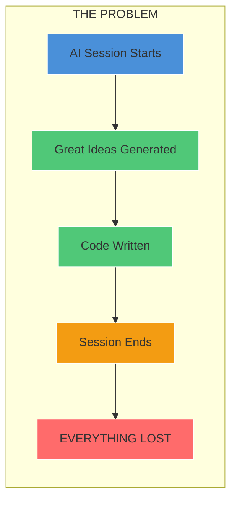

**Without GAIT:**
- AI conversations are ephemeral - they vanish when the session ends
- You cannot rewind to a previous point in the reasoning
- You cannot branch to explore alternative approaches
- You cannot share AI context across different tools or team members
- Code generated has no link to the reasoning that created it

**With GAIT:**
- Every turn (user prompt + AI response) is versioned
- Code artifacts are tracked with their reasoning context
- You can revert, branch, and merge AI thought processes
- Context survives editor restarts
- Cloud sync available via GAITHUB-compatible servers

### The Restaurant Analogy

Think of GAIT like a **restaurant order history system**:

| Without GAIT | With GAIT |
|--------------|-----------|
| Waiter remembers orders in head | Orders written on tickets |
| If waiter forgets, start over | Can review any past order |
| Cannot modify previous orders | Can adjust and resubmit |
| One waiter, one memory | Any waiter can continue |
| No record of what worked | Learn from successful orders |

---

## 2. How Does It Work?

### Architecture Overview

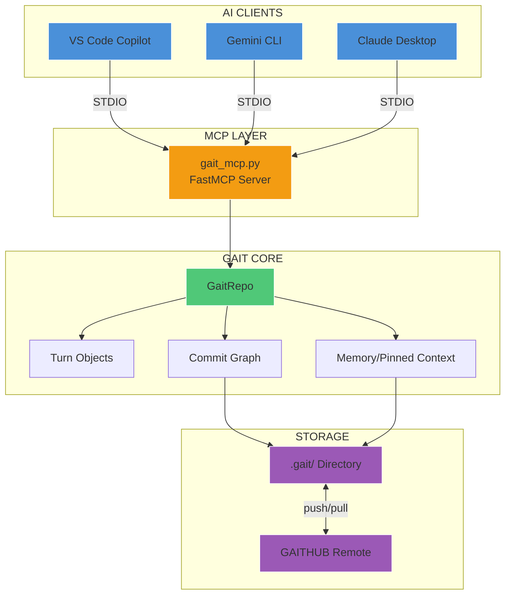

### Core Components

#### 1. MCP Server (gait_mcp.py)

The Model Context Protocol server exposes GAIT functionality as tools:

| Tool | Purpose |
|------|---------|
| `gait_init` | Initialize GAIT tracking in a directory |
| `gait_status` | Show repo status (branch, HEAD) |
| `gait_record_turn` | Record a conversation turn with artifacts |
| `gait_log` | Show commit history |
| `gait_show` | Display a specific commit |
| `gait_revert` | Rewind to a previous state |
| `gait_resume` | Sync AI state after revert |
| `gait_branch` | Create a new branch |
| `gait_checkout` | Switch branches |
| `gait_merge` | Merge branches |
| `gait_pin` / `gait_unpin` | Manage pinned memory |
| `gait_push` / `gait_pull` | Sync with remote |

#### 2. Turn Objects

A **Turn** captures one exchange:

```python
Turn = {
    "user": {
        "text": "Create a Python function that..."
    },
    "assistant": {
        "text": "Here's the implementation..."
    },
    "context": {
        "artifacts": [
            {"path": "src/utils.py", "content": "def foo():..."}
        ],
        "pinned_context": {...}
    },
    "model": {"provider": "vscode-copilot"},
    "tokens": 1234
}
```

#### 3. Commit Graph

Like Git, GAIT maintains a directed acyclic graph (DAG) of commits:

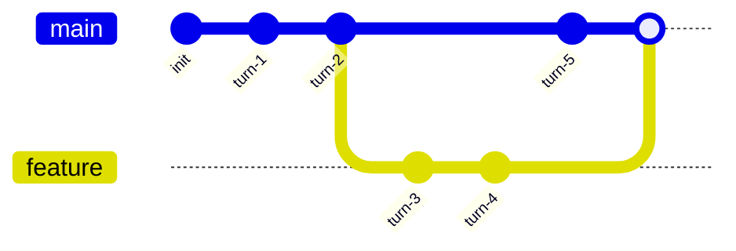

#### 4. Memory System

The **pinned memory** system lets you mark important turns for context:

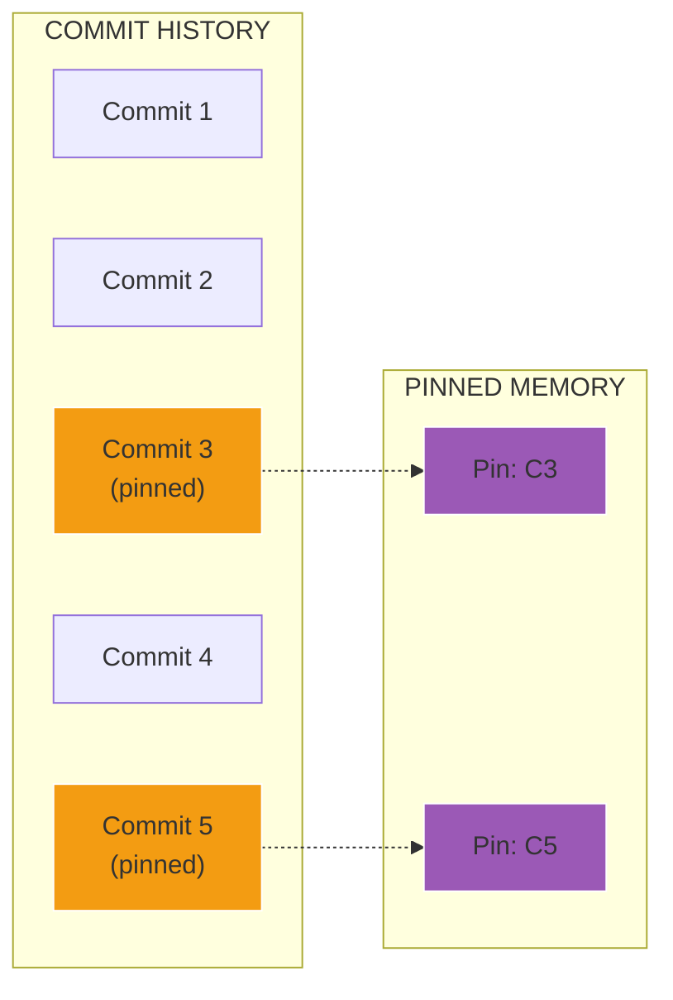

### Data Flow: Recording a Turn

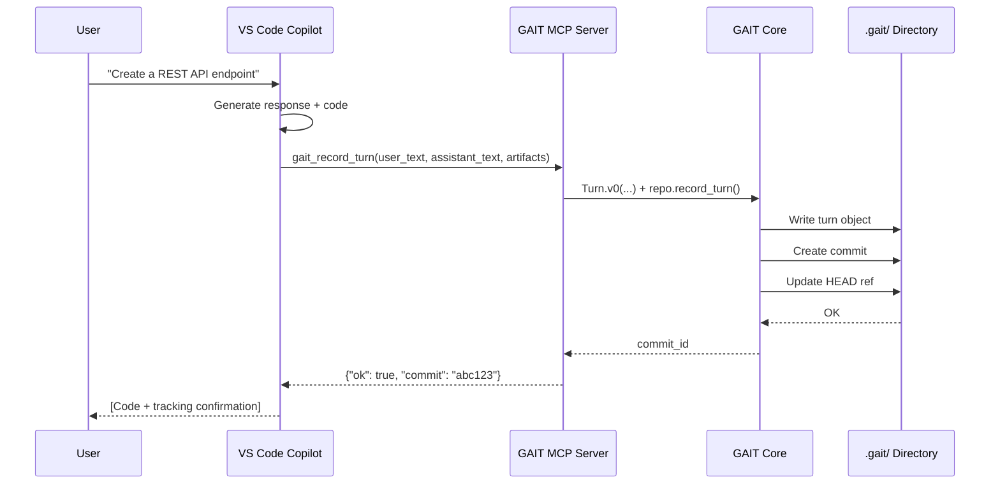

### Storage Structure

```
project/
├── .gait/                      # GAIT repository (like .git/)
│   ├── objects/                # Content-addressed storage
│   │   ├── turns/             # Turn objects
│   │   └── commits/           # Commit objects
│   ├── refs/
│   │   ├── heads/             # Branch refs (main, feature, etc.)
│   │   └── memory/            # Memory refs per branch
│   ├── HEAD                   # Current branch pointer
│   └── config                 # Repository configuration
├── src/                       # Your actual code
└── README.md
```

---

## 3. Why Does It Work?

### The Underlying Principles

#### 1. Content-Addressed Storage

Like Git, GAIT uses SHA-based addressing:

```
Turn ID = SHA256(user_text + assistant_text + artifacts + timestamp)
```

This guarantees:
- **Immutability**: Objects never change
- **Deduplication**: Identical content = identical ID
- **Integrity**: Corruption is immediately detectable

#### 2. Append-Only History

GAIT follows an append-only model:

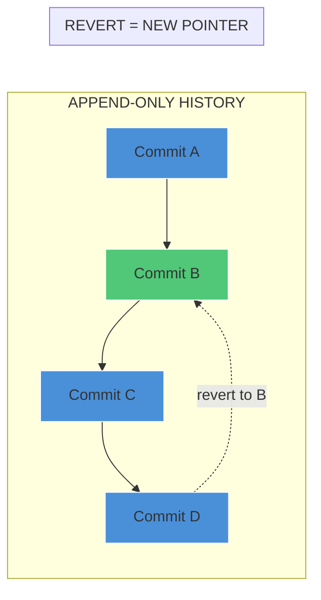

**Reverting does not delete history** - it moves the HEAD pointer. Original commits remain accessible.

#### 3. Branching for Exploration

AI problem-solving often requires exploring alternatives:

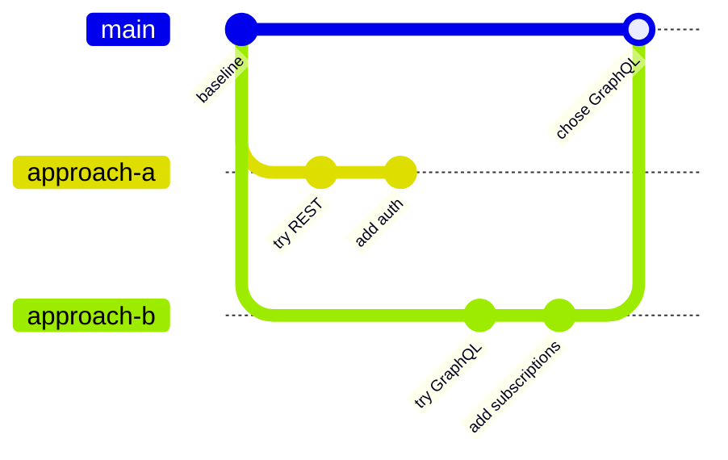

GAIT branches let you:
- Try different approaches without losing work
- Compare AI reasoning paths
- Merge the best solution back

#### 4. Context Preservation

The **artifacts** field solves a critical problem:

| Without Artifacts | With Artifacts |
|-------------------|----------------|
| "I created a file" | Full file content stored |
| Lost on session end | Reproducible forever |
| Cannot diff changes | Full diff capability |
| Reasoning disconnected from code | Code + reasoning linked |

#### 5. Memory Pinning

Not all turns are equally important. Pinning lets you:
- Mark key decisions
- Preserve important context
- Build a curated history for future sessions

---

## 4. Why We Choose to Run This Way

### Design Decisions Explained

#### Decision 1: MCP Protocol (STDIO)

**Why STDIO over HTTP?**

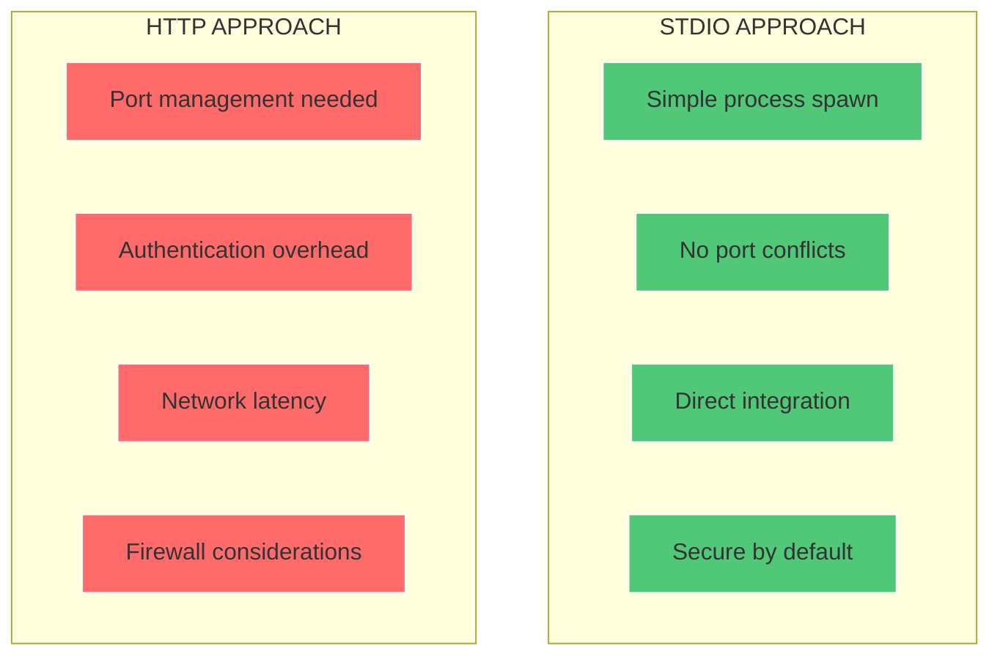

STDIO is simpler, faster, and more secure for local tool integration.

#### Decision 2: FastMCP Framework

**Why FastMCP?**

| Feature | Benefit |
|---------|---------|
| Decorators | Clean tool definition (`@mcp.tool`) |
| Auto-serialization | Handles JSON/dict conversion |
| Error handling | Structured error responses |
| Async support | Non-blocking operations |

#### Decision 3: Local-First with Optional Remote

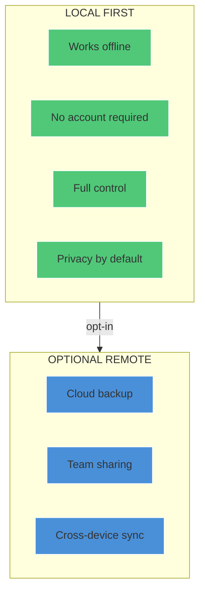

#### Decision 4: Git-Like Semantics

**Why mirror Git?**

- Familiar mental model for developers
- Proven concepts (branch, merge, revert)
- Easy to explain and adopt
- Natural mapping of AI workflows

#### Decision 5: Sticky Repository Root

The server remembers the last initialized repo via `~/.gait_mcp_root`:

```python
_STICKY_FILE = Path("~/.gait_mcp_root").expanduser()
```

This ensures:
- Survives editor restarts
- No re-initialization needed
- Works across MCP reconnections

---

## 5. What Are the Other Options?

### Alternative Approaches Comparison

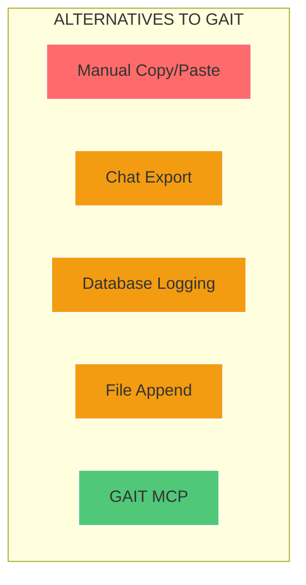

### Option 1: Manual Copy/Paste

**How it works:** Copy AI responses to notes manually.

| Pros | Cons |
|------|------|
| No setup | Labor-intensive |
| Works anywhere | Easy to forget |
| Human curation | No automation |
| | No version control |
| | Loses code-context link |

### Option 2: Chat Export

**How it works:** Export chat history from the AI tool.

| Pros | Cons |
|------|------|
| Built into some tools | Format varies by tool |
| Complete transcript | No branching/merging |
| | Export-only (no revert) |
| | Artifacts often missing |
| | Tool-specific |

### Option 3: Database Logging

**How it works:** Log all interactions to SQLite/PostgreSQL.

| Pros | Cons |
|------|------|
| Queryable | No version semantics |
| Structured | Separate from code |
| Scalable | Requires DB setup |
| | No branch/merge |
| | Heavy for simple use |

### Option 4: File Append

**How it works:** Append each turn to a text file.

| Pros | Cons |
|------|------|
| Simple | Grows unbounded |
| Readable | No structure |
| No dependencies | No revert capability |
| | No branching |
| | No deduplication |

### Option 5: GAIT MCP (This Solution)

**How it works:** Git-like version control via MCP.

| Pros | Cons |
|------|------|
| Full version control | Requires MCP support |
| Branching and merging | Learning curve |
| Code artifacts tracked | Additional tooling |
| Revert capability | |
| Memory pinning | |
| Remote sync | |
| Tool-agnostic | |

---

## 6. Why This Option Is Better

### Feature Comparison Matrix

| Feature | Copy/Paste | Export | Database | File Append | GAIT |
|---------|:----------:|:------:|:--------:|:-----------:|:----:|
| Automatic tracking | - | - | + | + | + |
| Version history | - | - | + | - | + |
| Branching | - | - | - | - | + |
| Merging | - | - | - | - | + |
| Revert capability | - | - | - | - | + |
| Artifacts tracked | - | +/- | + | - | + |
| Context pinning | - | - | - | - | + |
| Remote sync | - | - | + | - | + |
| Tool-agnostic | + | - | + | + | + |
| Offline-first | + | + | +/- | + | + |
| Familiar semantics | + | + | - | + | + |

### Key Advantages

#### 1. Reproducibility

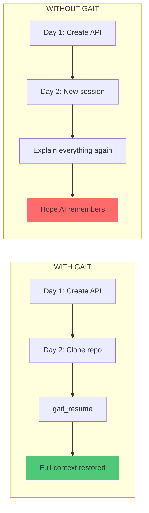

#### 2. Exploration Without Fear

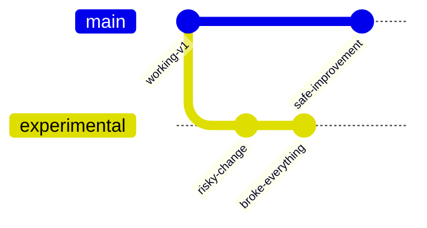

With GAIT, you can experiment freely knowing you can always revert.

#### 3. Team Collaboration

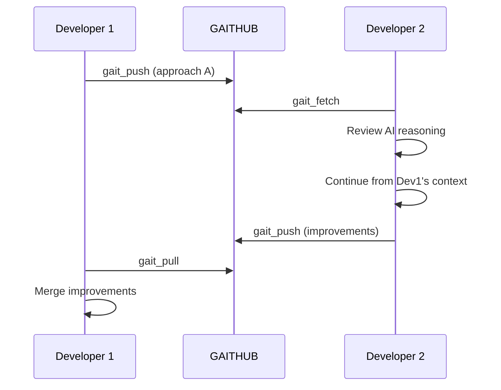

#### 4. Audit Trail

Every decision is documented:
- What was asked
- What was answered
- What code was generated
- When it happened
- How it relates to other decisions

---

## 7. Rollback Plan - When Things Go Wrong

### Scenario Matrix

| Problem | Solution | Command |
|---------|----------|---------|
| Bad AI suggestion accepted | Revert to previous turn | `gait_revert("HEAD~1")` |
| Lost context after restart | Resume from HEAD | `gait_resume()` |
| Wrong branch active | Checkout correct branch | `gait_checkout("main")` |
| Corrupted local repo | Clone from remote | `gait_clone(...)` |
| MCP server crash | Restart server | Re-run `gait_mcp.py` |
| Sticky root wrong | Delete sticky file | `rm ~/.gait_mcp_root` |

### Recovery Procedures

#### Procedure 1: Revert to Previous State

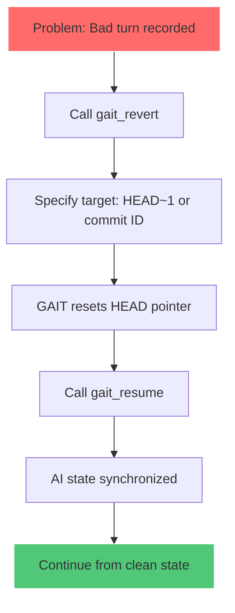

**Commands:**
```
1. gait_revert(target="HEAD~1", also_memory=True)
2. gait_resume(turns=10)
3. [Continue working]
```

**Critical Rule:** After `gait_revert`, always call `gait_resume`. Never record a turn for the revert action itself.

#### Procedure 2: Recover Lost Context

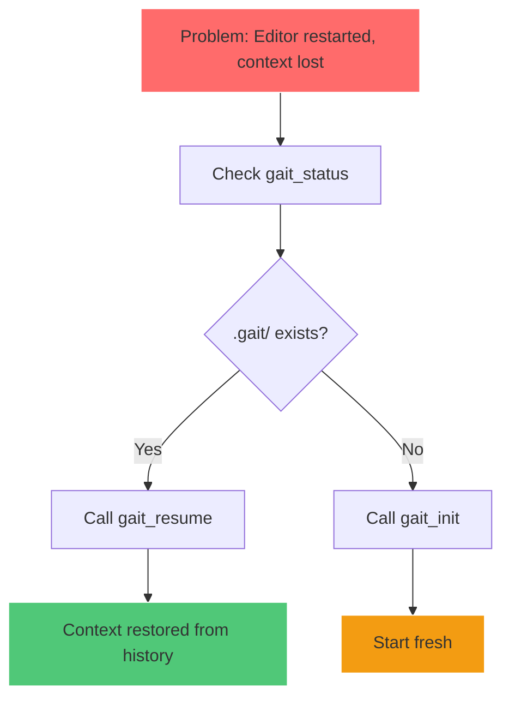

#### Procedure 3: Branch Rescue

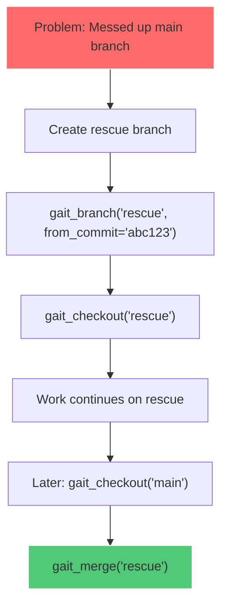

#### Procedure 4: Squash Long History

When history becomes too long:

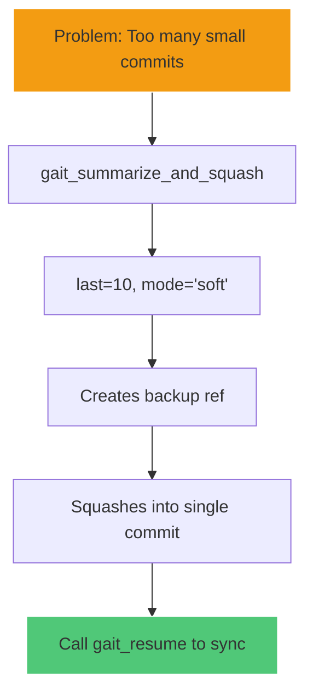

**Safe squash (keeps backup):**
```
gait_summarize_and_squash(last=10, mode="soft")
gait_resume()
```

#### Procedure 5: Remote Recovery

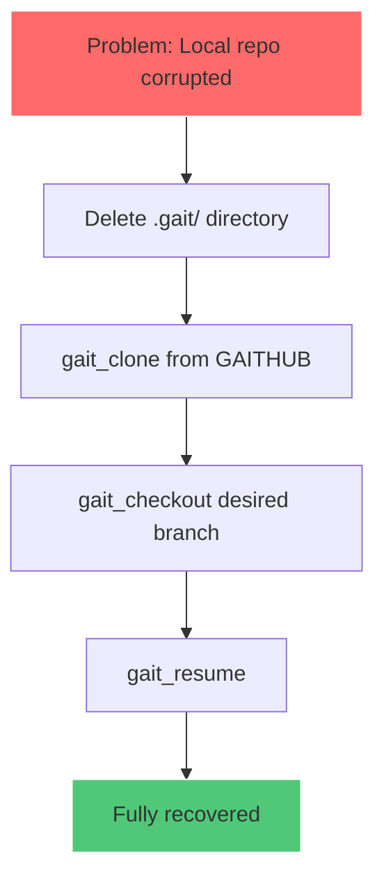

### Emergency Contacts

| Issue Type | Action |
|------------|--------|
| Bug in gait_mcp.py | File issue on GitHub |
| GAIT core library bug | Check gait-ai package issues |
| MCP protocol issue | Check FastMCP documentation |
| GAITHUB remote issue | Verify GAITHUB_TOKEN and server status |

### Prevention Checklist

- [ ] Enable Chat Instructions for automatic tracking
- [ ] Configure GAITHUB remote for backup
- [ ] Regularly push to remote
- [ ] Use soft mode for squashing
- [ ] Never init at filesystem root
- [ ] Always call `gait_resume` after `gait_revert`

---

## Quick Reference

### Essential Commands

| Action | Command |
|--------|---------|
| Initialize | `gait_init(path=".")` |
| Check status | `gait_status()` |
| Record work | `gait_record_turn(user_text, assistant_text, artifacts)` |
| View history | `gait_log(limit=20)` |
| Show commit | `gait_show(commit="HEAD")` |
| Revert | `gait_revert(target="HEAD~1")` |
| Resume | `gait_resume(turns=10)` |
| Create branch | `gait_branch(name="feature")` |
| Switch branch | `gait_checkout(name="main")` |
| Merge | `gait_merge(source="feature")` |

### Configuration Files

| File | Purpose |
|------|---------|
| `~/.gait_mcp_root` | Sticky repository path |
| `.github/instructions/gait-mcp.md` | VS Code Chat Instructions |
| `GAITHUB_TOKEN` env var | Remote authentication |

### MCP Server Configuration

**VS Code (macOS/Linux):**
```json
{
  "servers": {
    "gait": {
      "type": "stdio",
      "command": "/path/to/python",
      "args": ["-u", "/path/to/gait_mcp.py"],
      "env": {
        "GAITHUB_TOKEN": "your_token"
      }
    }
  }
}
```

---

## Troubleshooting Guide

### Common Issues

#### Issue: "GAIT repo not found"

**Cause:** No `.gait/` directory in current or parent paths.

**Solution:**
```
1. Navigate to project directory
2. Call gait_init(path=".")
3. Verify with gait_status()
```

#### Issue: "Refusing to initialize at filesystem root"

**Cause:** Attempted `gait_init` at `/` or equivalent.

**Solution:** Navigate to a project folder first.

#### Issue: Recording creates infinite loops

**Cause:** Recording the "tracked successfully" message.

**Solution:** Never call `gait_record_turn` for:
- Revert operations
- Resume operations
- Status checks
- Tool confirmations

#### Issue: Context not restored after restart

**Cause:** Sticky file missing or wrong path.

**Solution:**
```
1. gait_status(path="/full/path/to/project")
2. This updates the sticky file
3. Future calls auto-discover
```

#### Issue: Artifacts missing from history

**Cause:** `gait_record_turn` called without artifacts.

**Solution:** Always include full file content:
```python
artifacts = [
    {"path": "src/app.py", "content": "full file content..."}
]
gait_record_turn(user_text="...", assistant_text="...", artifacts=artifacts)
```

---

## Conclusion

GAIT MCP transforms AI-assisted development from ephemeral chat sessions into a versioned, reproducible workflow. By applying Git-like semantics to AI conversations, it enables:

- **Persistent memory** across sessions
- **Branching** for exploration
- **Reverting** when things go wrong
- **Collaboration** via remote sync
- **Audit trails** for every decision

The investment in setup pays dividends in productivity, reproducibility, and peace of mind.

---

*GAIT MCP MASTERCLASS - Created by The Professor (Agent #27)*
*For questions or improvements, file an issue on GitHub.*
